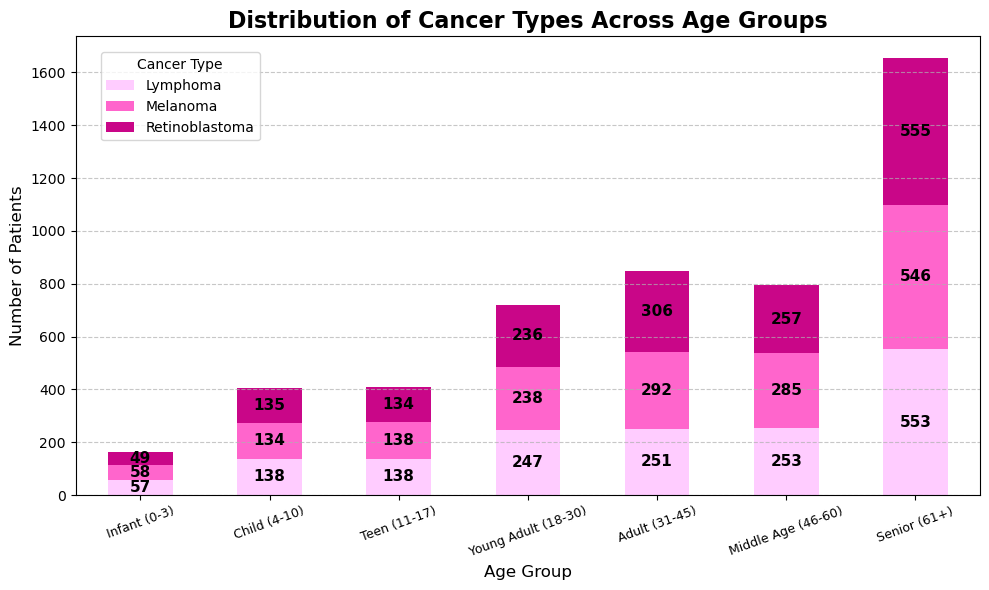
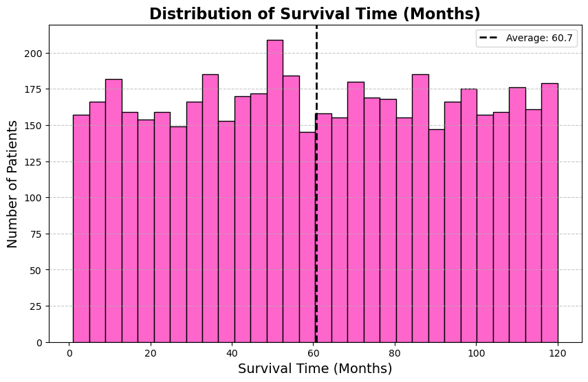

# Exploratory Data Analysis (EDA) Notes 
# Eye Cancer Patients Record Project
August 15, 2025

## 1. Dataset Overview / Size
**Questions:** 
- How many patients are in the dataset?
- How many patients have each cancer type?
**Purpose:** Understand the dataset size, which is fundamental for context.

**Total Patients Recorded in This Dataset: 5000**

---

## 2. Demographic Distribution
**Questions:**  
- What is the distribution of age, gender, and other demographics?  
- How many female, male, and other in the dataset?
- 

**Purpose:** Describe the population. Helps detect imbalances (like more males than females) which could affect analysis.

---

## 3. Cancer Stage-Specific Counts
**Question:** 
- For each cancer type, how many patients are diagnosed at Stage IV?
- 

**Purpose:** To identify which cancer types are most frequently diagnosed at Stage IV. This helps focus the analysis on advanced-stage cases, informs prevalence, and guides sampling or treatment considerations.

---

## 4. Survival Analysis / Outcome Exploration
**Questions:**  
- What is the average survival time for patients?  
- Which cancer type has the highest or lowest average survival time?  
- Does age affect survival time?  

**Purpose:** Explore relationships between patient features (age, cancer type) and outcomes (survival time).

---

## 5. Cross-Tab / Group Comparisons
**Questions:**  
- How does gender distribution vary across cancer types?  
- How many patients at terminal stage for each cancer type?  

**Purpose:** Examine differences across groups (cancer type, gender, stage). Helps identify patterns or disparities.
