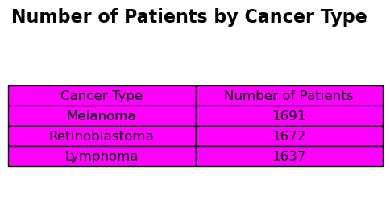
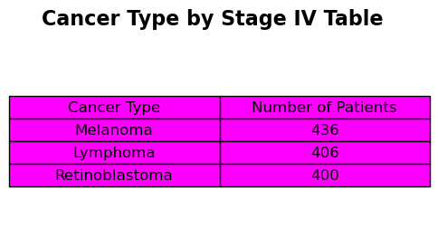
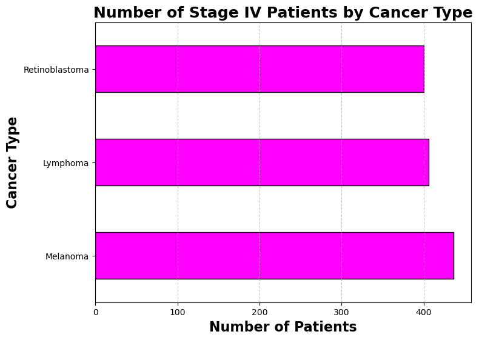
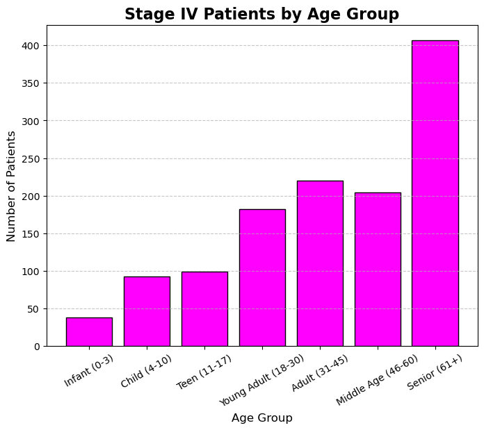

# Eye Cancer Patients Data Analysis

## Project Summary
The goal of this project is to showcase my data analysis skills using Python. I chose the Eye Cancer Patients Record Dataset from Kaggle because of my background in cancer biology research, which inspired me to explore data-driven insights in this field.

The dataset is already preprocessed and cleaned, so the focus of this project is on analysis rather than data preparation. The Genetic Markers column was removed because it contained over 50% missing values, which could have impacted the overall statistics and analysis. Using Jupyter Notebook and Python, I performed exploratory data analysis (EDA), visualizations, and group comparisons to uncover patterns and relationships within the data.

The primary aim is to connect the “dots” in the dataset and generate insights that could inform future scientific research. This project demonstrates both my technical proficiency in Python and my ability to translate raw data into meaningful observations.

## Key Skills & Tools
- **Languages & Tools:** Python, Jupyter Notebook, pandas, matplotlib, seaborn, numpy  
- **Data Analysis Techniques:** EDA, descriptive statistics, group comparisons, cross-tabulations, data visualization  
- **Focus:** Pattern recognition, relationships in patient demographics and cancer types, actionable insights  

## Project Objectives
1. Analyze the distribution of patients by **age, gender, and cancer type**.  
2. Explore relationships between **demographics and survival outcomes**.  
3. Create visualizations that clearly summarize findings and trends.  
4. Develop insights that could support scientific reporting or further research.  

## Why This Project Matters
This project bridges my scientific research background with data analytics. By analyzing a real-world biomedical dataset, I demonstrate the ability to transform complex data into understandable and actionable insights. It is a showcase of my ability to combine domain knowledge with analytical skills to produce meaningful results.

## 1. Dataset Overview / Size
**Questions:** 
- How many patients are in the dataset?
- How many female, male, and other in the dataset?
- How many patients have each cancer type?

**Purpose:** Understand the dataset size, which is fundamental for context.

**Total Patients Recorded in This Dataset: 5000**

---

## 2. Demographic Distribution
**Questions:**  
- What is the distribution of age, gender, and other demographics?  
- 
- 

**Purpose:** Describe the population. Helps detect imbalances (like more males than females) which could affect analysis.

---

## 3. Cancer Stage-Specific Counts
**Question:** 
- For each cancer type, how many patients are diagnosed at Stage IV?
- 

**Purpose:** To identify which cancer types are most frequently diagnosed at Stage IV. This helps focus the analysis on advanced-stage cases, informs prevalence, and guides sampling or treatment considerations.

---

## 4. Survival Analysis / Outcome Exploration
**Questions:**  
- What is the average survival time for patients?  
- Which cancer type has the highest or lowest average survival time?  
- Does age affect survival time?  

**Purpose:** Explore relationships between patient features (age, cancer type) and outcomes (survival time).

---

## 5. Cross-Tab / Group Comparisons
**Questions:**  
- How does gender distribution vary across cancer types?  
- How many patients at terminal stage for each cancer type?  

**Purpose:** Examine differences across groups (cancer type, gender, stage). Helps identify patterns or disparities.

August 15, 2025
